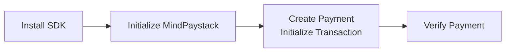

# Getting Started

This guide shows how to **install**, **initialize**, and **make your first payment** with MindPaystack.  
For an overview of its architecture and design, see [Introduction](../introduction).

---

## Quick workflow

<div align="center">



*Figure 1: MindPaystack integration steps.*
</div>

---

## 1. Install

Add the **core SDK** (works in any Dart project):

```sh
dart pub add mind_paystack
```

If you’re building a **Flutter app**, also add the Flutter integration layer:

```sh
dart pub add mind_paystack_flutter
```

---

## 2. Initialize the SDK

Initialize once at app start using your Paystack keys.  
**Use test keys** in non-production environments.

```dart
import 'package:mind_paystack/mind_paystack.dart';

Future<void> main() async {
  await MindPaystack.init(
    PaystackConfig(
      publicKey: 'pk_test_xxx',
      secretKey: 'sk_test_xxx',
      // environment: Environment.test, // default
      // logLevel: LogLevel.info,       // default
    ),
  );

  // ... run your app
}
```

In Flutter, call `MindPaystack.init()` **before** `runApp()`:

```dart
import 'package:flutter/widgets.dart';
import 'package:mind_paystack_flutter/mind_paystack_flutter.dart';

Future<void> main() async {
  WidgetsFlutterBinding.ensureInitialized();
  await MindPaystack.init(
    PaystackConfig(
      publicKey: 'pk_test_xxx',
      secretKey: 'sk_test_xxx',
    ),
  );
  // runApp(...)
}
```

---

## 3. Make a Payment

Use the **Transaction API** to initialize a payment session:

```dart
final paystack = MindPaystack.instance;

final tx = await paystack.transaction.initializeTransaction(
  amount: 500000,              // 5000.00 in kobo
  email: 'customer@example.com',
  currency: 'NGN',
  // optional:
  // reference: 'your-unique-ref',
  // callbackUrl: 'https://example.com/callback',
  // channels: ['card', 'bank', 'ussd'],
  // metadata: {'orderId': '12345'},
);

// tx.authorizationUrl → open in a webview/browser
// tx.reference         → store for verification
```

Verify the payment when the user returns from checkout:

```dart
final verification = await paystack.transaction.verifyTransaction(tx.reference);
if (verification.status == 'success') {
  // fulfill the order
}
```

---

## 4. Next Steps

- Explore configuration options → **Configuration**  
- Learn SDK internals → **Core Concepts**  
- Follow end-to-end guides → **Payments**, **Transactions**  
