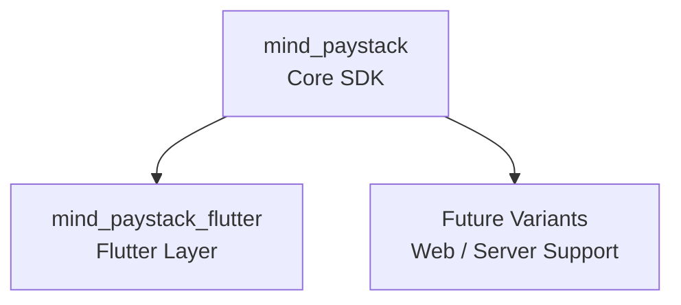

# MindPaystack

> **Quick Overview**  
> A modern Dart + Flutter SDK for Paystack built with clean architecture, dependency injection, and strongly typed APIs.  
> Use it to integrate payments faster, with fewer bugs, and a structure that scales from MVPs to production fintech platforms.

---

## Why MindPaystack?
Unlike thin API wrappers, MindPaystack is designed to scale with your application architecture.  
It focuses on **maintainability**, **testability**, and **separation of concerns**, making it easy to integrate into production-grade apps.

---

## What Does It Power?

MindPaystack provides a **core SDK** that can adapt to different environments:  

- **mind_paystack** → Core, framework-agnostic Dart SDK  
- **mind_paystack_flutter** → Flutter integration layer  
- **Future variants** → Planned support for web and server-side use cases  

*Figure 1: MindPaystack layers and planned ecosystem.*

---

## How Is It Structured?

Internally, the SDK follows a **modular service-oriented design**:  

- **Services** → High-level entry points for payment operations.  
- **API Clients** → Handle HTTP requests, retries, and authentication.  
- **Models** → Strongly typed responses for safety and autocompletion.  
- **Exceptions** → Unified error handling for predictable failure states.  

<strong>See full architecture diagram</strong>

 

*Figure 2: Internal SDK module flow.*

---

## Key Features
- **Strongly typed API responses** → Avoid dynamic types and runtime surprises.  
- **Dependency injection ready** → Built with [`injectable`](https://pub.dev/packages/injectable) for modular, testable services.  
- **Modular service architecture** → Swap or extend services without rewriting core logic.  
- **Unified error handling** → Consistent failure states via `MindException`.  
- **Cross-platform support** → Works seamlessly in both Dart and Flutter projects.  

---

## When to Use MindPaystack
- **Mobile apps** → Accept and manage payments directly from Flutter apps.  
- **Backend / CLI tools** → Server-side integrations using pure Dart.  
- **Hybrid apps** → Share a common payment layer across multiple platforms.  

Whether you’re building a **startup MVP** or a **production fintech platform**,  
MindPaystack helps you ship faster with fewer integration bugs.
